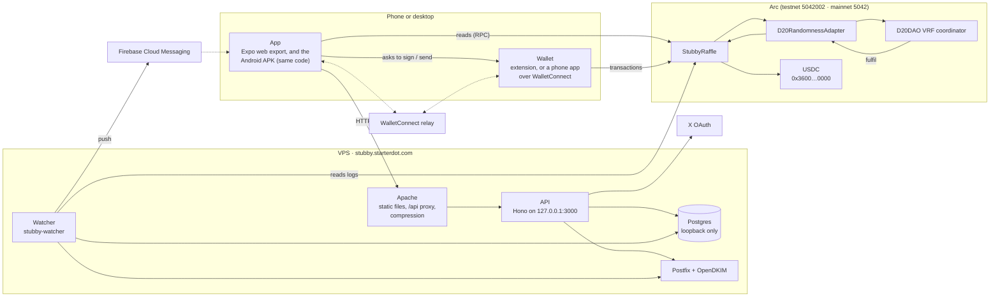
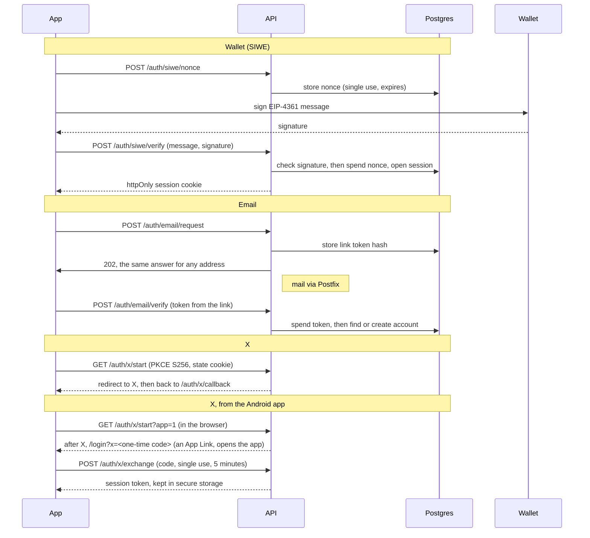
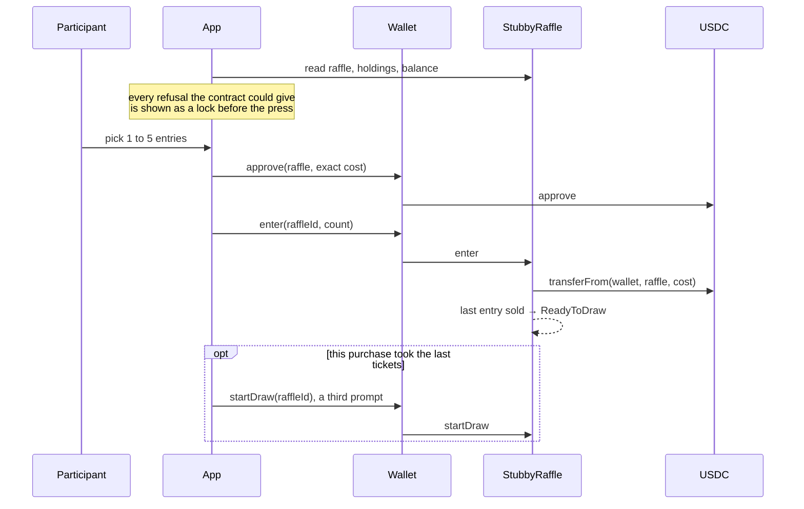
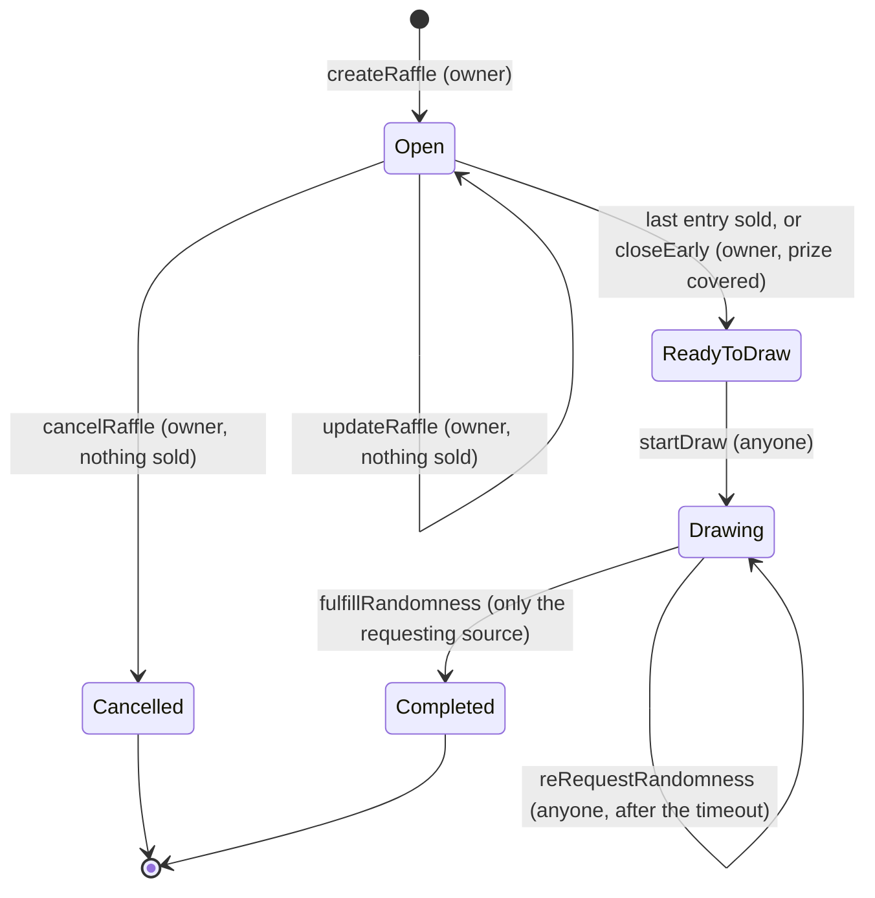
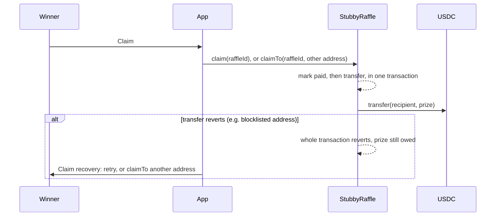

# Architecture

How the pieces of Stubby fit together, and the three flows that move money:
entry, draw and claim. The product brief (`stubby-project-brief.md`) says what
and why; this says how. Decisions have their own records in `adr/`.

## The pieces

**The chain is the source of truth for money.** Every screen that shows a
prize, an entry or a claim reads the contract directly. The API holds what is
about people, not money: accounts, sessions, linked wallets, login links, rate
limits, usernames, referrals, mail and push preferences, and phones registered
for push. Losing the database loses logins and referral history, never funds
(Section 4.3).

**The watcher** is a second process from the API's bundle. It mirrors raffles,
entries and each draw's transactions into Postgres; awards referral bonuses;
tells entrants their results by mail and push; and mails the owner what needs
a look (`docs/deploying.md`, The watcher). It reads the chain only; it holds no
key that moves money.

**The Android app is the same code as the web app**, built into a signed APK
on GitHub Actions and hosted on the site at `/download/stubby.apk` rather than
in a store (`docs/deploying.md`, The Android app).

**The API never holds a key that can move money.** Owner transactions are sent
by the platform owner from their own wallet (`docs/mainnet-deploy.md`).

| Piece     | Where                | Notes                                                                       |
| --------- | -------------------- | --------------------------------------------------------------------------- |
| App       | `apps/app`           | Expo Router, static export. Every `EXPO_PUBLIC_*` is inlined at build time. |
| API       | `apps/api`           | Hono + `@hono/node-server`. Owns its SQL migrations.                        |
| Contracts | `packages/contracts` | Foundry. Singleton, non-upgradeable (ADR 0003).                             |
| Shared    | `packages/shared`    | Chains, units, SIWE, raffle math: one copy for app, API and tests.          |
| Hosting   | `docs/deploying.md`  | One VPS: Apache, systemd, Postgres, Postfix (ADRs 0009, 0010).              |

## Signing in

Three ways in, one account (Section 4.1). A wallet can also be linked to an
account that signed in some other way; it is never taken from another account.

Linking a wallet that already belongs to an account made of nothing but
wallets (someone who once signed in with the wallet alone) folds that account
into the signed-in one. An account with its own email or X login is refused.

## Entry

- **Two prompts**, announced before the first, because the contract pulls
  payment with `safeTransferFrom`. The approval is for the exact cost.
- **Gas comes from the same balance** as the ticket money (Arc's USDC is the gas
  token), so the picker reserves it.
- The per-wallet cap (`walletCap`: a quarter of the draw, at most five) and the
  sold-out check are enforced by the contract; the app only predicts them.
- **The last buyer starts the draw.** When a purchase takes the last tickets,
  the same slide asks for a third signature, `startDraw`, and pays its gas.

## Draw

- **Filling a raffle does not start its draw.** Requesting randomness is an
  external call, and a broken coordinator must not make the last entry fail.
  `startDraw` is a separate, permissionless call. The app makes the last buyer
  send it (see Entry), anyone can send it from the draw screen, and the
  watcher mails the owner if ten minutes pass with nobody doing it
  (`docs/runbooks.md`).
- **The winner** is `randomWord % entriesSold`, mapped to the wallet that bought
  that entry by a binary search over purchase segments.
- A re-request does not cancel the request before it: every request a draw
  has made stays answerable, and the first answer settles the draw. A later
  one is ignored rather than reverted, so a slow provider cannot retry
  forever, and nobody can throw away a late answer they dislike by
  re-requesting first.

## Claim

- No deadline and no limit on retries (Section 6.1).
- Only the winning wallet can call `claimTo`, so nobody else can redirect a
  prize.
- Commission is **pulled** by the owner with `withdrawCommission`, so a treasury
  that cannot receive USDC never blocks a winner.

## Draws the owner changes

`updateRaffle` and `cancelRaffle` work only while a draw is open with **no
tickets sold**: after that, its terms are a promise to the buyers. A cancelled
draw is final and returns any top-up to the owner; the app hides it. The prize
is at least `MIN_PRIZE` (10 USDC), and a wallet may hold `walletCap`, a quarter
of the draw and at most 5, so nobody holds more than 25% of the odds.

## Notifications

Three channels, each off-able on its own:

- **In the app:** the bell and the win greeting are built from the wallet's
  holdings, read from the chain, so they can never claim what the contract
  does not. "Seen" is remembered on the device.
- **Push (Android):** the phone registers its FCM token with the API when
  signed in; the watcher sends a win, a result and a referral bonus once each,
  through FCM's HTTP v1 API with a service account, and deletes tokens FCM
  calls gone.
- **Email:** results and referral news, each with a one-click unsubscribe
  (RFC 8058). Sign-in links always arrive.

## What the contract always holds

`USDC balance ≥ escrow + unclaimed prizes + unwithdrawn commission`, exposed as
`requiredHoldings()`. It is an invariant test in `packages/contracts` and was
confirmed on testnet after full lifecycles (brief, 13.5).
